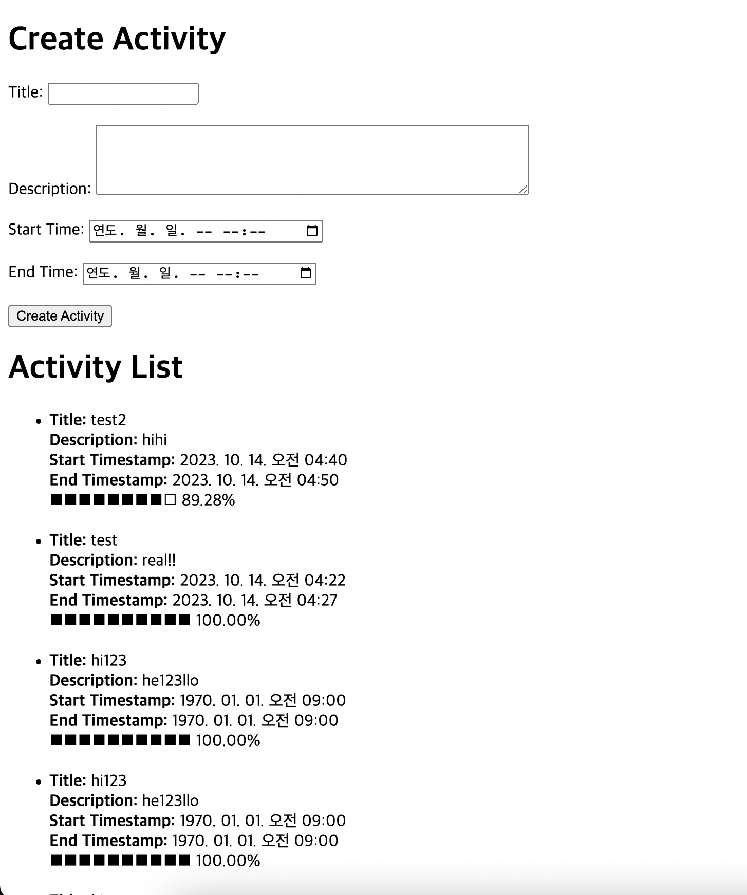

# Focus

It will help me focus on a few things.

Clone the repository and execute the following command at `{ROOT_OF_REPO}/http` to run the http server.

```zsh
go run ./cmd
```

## How to Use



- Create an activity through the form on the top.
- Check the activities below the form. It shows the ratio of the time has been passed by after you have started the activity out of the total time you have until the expected end of the activity.
  - It is supposed to help you realize if you have spent too much time or not. Do not use it as a deadline. Just let it remind you and encourage you.
